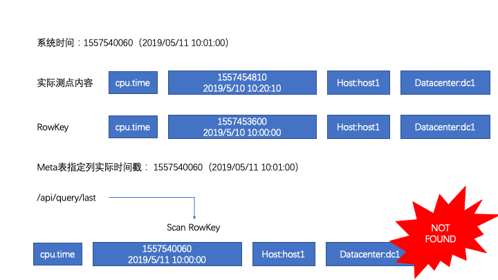

## 简述
OpenTSDB 作为一款流行的时序数据库在数据存储方面还是比较优秀的，但是在查询的时候，总感觉不是那么顺手，例如我想查询所有 tag 为指定值的所有测点信息，直接查询是做不到的，但是通过Metadata，我们就打开了更为自由的大门。

## 什么是Metadata
它主要由两个部分组成：

***UIDMeta***

> Every data point stored in OpenTSDB has at least three UIDs associated with it. There will always be a metric and one or more tag pairs consisting of a tagk or tag name, and a tagv or tag value. When a new name for one of these UIDs comes into the system, a Unique ID is assigned so that there is always a UID name and numeric identifier pair.
(每一个存入OpenTSDB的数据点至少具有三个与之关联的UID。总会有一个测点和一个或多个标记对，每个标记对由一个标记名和一个标记值组成。当有一个新的与UID关联的名称进入系统，一个唯一的ID会与之关联。)

> Each UID may also have a metadata entry recorded in the tsdb-uid table. Data available for each UID includes immutable fields such as the uid, type, name and created timestamp that reflects the time when the UID was first assigned. Additionally some fields may be edited such as the description, notes, displayName and a set of custom key/value pairs to record extra information. For details on the fields, see the /api/uid/uidmeta endpoint.
(每一个UID所关联的信息存储在 tsdb-uid 表中。当一条UID记录生成后就包含了一些不可变更的字段，如uid,type,name, created timestamp)。一些附加可编辑字段，例如description, notes, displayName 和一些自定义的用来存储附加信息的键值对。要想获得更详细的信息，可以使用 /api/uid/uidmeta 接口。)

>Whenever a new UIDMeta object is created or modified, it will be pushed to the Search plugin if a plugin has been configured and loaded. For information about UID values, see UIDs and TSUIDs.
(当UIDMeta对象创建或修改，如果我们配置了搜索插件，那么相关信息将会被送往搜索插件。)


***TSMeta***

>Each timeseries in OpenTSDB is uniquely identified by the combination of it's metric UID and tag name/value UIDs, creating a TSUID as per UIDs and TSUIDs. When a new timeseries is received, a TSMeta object can be recorded in the tsdb-uid table in a row identified by the TSUID. The meta object includes some immutable fields such as the tsuid, metric, tags, lastReceived and created timestamp that reflects the time when the TSMeta was first received. Additionally some fields can be edited such as a description, notes and others. See /api/uid/tsmeta for details.
(在OpenTSDB中每一条时间序列都是由测点名UID和标示对UID组成的唯一值。当一条新的时间序列记录进入系统，一个TSMeta对象存入tsdb-uid表，并将TSUID作为它的row key。meta对象包含一些不可变更的字段：tsuid，metric，tags，lastReceived，created timestamp。除了以上一些字段外，它还包含了一些可变更的字段，例如：description，notes 等。具体的可以查阅 /api/uid/tsmeta 获取详细信息。)

## 开启 Metadata 并开启 Metadata 检索

默认情况下OpenTSDB并未开启Metadata功能，为了开启相关功能，我们需要调整一下配置。

* tsd.core.meta.enable_realtime_uid = true
* tsd.core.meta.enable_realtime_ts = true
* tsd.core.meta.enable_tsuid_tracking = true 或者 tsd.core.meta.enable_tsuid_incrementing = true

OpenTSDB 本身并没有提供meta信息的搜索服务，它只提供了相关接口。当有新的测点创建，OpenTSDB会调用插件，将相关元信息上报进入我们的检索引擎，以供我们后期检索。

我们这里选用ElasticSearh来作为我们的检索引擎，官方给出的ElasticSearch检索插件较老，无法支持ElasticSerach 6.x，我修改了一个版本，可以从我的 [github](https://github.com/designershao/opentsdb-elasticsearch.git) 中clone。

编译完放入指定文件夹以后，我们还需要调整配置文件，来告诉系统搜索组件的相关信息：

* tsd.search.enable = true
* tsd.search.plugin = net.opentsdb.search.ElasticSearch
* tsd.search.elasticsearch.host = ElasticSearch地址

**注意：开启Meta功能后会导致OpenTSDB写入性能发生下降，因为每次新添加数据，都会更新tsdb-meta。**


## 利用 Metadata 进行高级查询

假定我存入的相关测点信息内容如下：

| 测点名   |      tags      |  值 |
|----------|:-------------:|------:|
|  cpu.time |  host:1;datacenter:dc2 | 11 |
|  cpu.time |  host:1;datacenter:dc2 | 11 |
|  cpu.time |  host:2;datacenter:dc2 | 12 |
|  memory.used |  host:2;datacenter:dc4 | 56 |
|  memory.used |  host:1;datacenter:dc4 | 50 |


**查询 host:1;datacenter:dc2 中包含的所有测点**

请求：

地址：/api/search/tsmeta   
方法：POST   
请求体：

```json
{
    "query": "name=host1 AND name=dc2",
    "limit": 100,
    "startIndex": 0
}

```


```json
{
    "type": "TSMETA",
    "query": "name=host1 AND name=dc2",
    "metric": "*",
    "limit": 100,
    "time": 14,
    "results": [
        {
            "tsuid": "000002000002000002000003000006",
            "metric": {
                "uid": "000002",
                "type": "METRIC",
                "name": "cpu.time",
                "description": "",
                "notes": "",
                "created": 1557903203,
                "custom": null,
                "displayName": ""
            },
            "tags": [
                {
                    "uid": "000002",
                    "type": "TAGK",
                    "name": "host",
                    "description": "",
                    "notes": "",
                    "created": 1557388950,
                    "custom": null,
                    "displayName": ""
                },
                {
                    "uid": "000002",
                    "type": "TAGV",
                    "name": "host1",
                    "description": "",
                    "notes": "",
                    "created": 1557388950,
                    "custom": null,
                    "displayName": ""
                },
                {
                    "uid": "000003",
                    "type": "TAGK",
                    "name": "datacenter",
                    "description": "",
                    "notes": "",
                    "created": 1557388950,
                    "custom": null,
                    "displayName": ""
                },
                {
                    "uid": "000006",
                    "type": "TAGV",
                    "name": "dc2",
                    "description": "",
                    "notes": "",
                    "created": 1557905963,
                    "custom": null,
                    "displayName": ""
                }
            ],
            "description": "",
            "notes": "",
            "created": 1557905976,
            "units": "",
            "retention": 0,
            "max": "NaN",
            "min": "NaN",
            "displayName": "",
            "dataType": "",
            "lastReceived": 0,
            "totalDatapoints": 0
        }
    ],
    "startIndex": 0,
    "totalResults": 1
}
```

从返回信息中，我们可以轻松找到所有测点。

***

**查询最新的上报值**
查询最新上报的值我们可以使用接口 ***[/api/query/last](http://opentsdb.net/docs/build/html/api_http/query/last.html)*** ,不过这个接口依赖于Meta，所以必须打开Meta相关配置才能使用。

**原理：**  
当访问 查询最新上报的值我们可以使用接口 ***[/api/query/last](http://opentsdb.net/docs/build/html/api_http/query/last.html)*** 接口后，OpenTSDB 首先根据测点和相关Tags拼凑出UID，然后前往tsdb-meta表中进行查找，查找到相关记录后，找出列的最新时间戳，利用该时间戳找出最近的小时时间戳，随后拼凑出一个包含该时间戳的RowKey(该RowKey实际上就是该时间戳所在的实际记录RowKey),扫描tsdb表，随后找出最后更新的记录列，该列的值就是最后的更新值。

**缺陷：**  
从上面的原理上我们可以知道，查找最后上报值实际上是与最后的写入时间有关。如果存入系统的是历史数据，则tsdb-meta中的列修改时间戳，与上报时间戳是不一致的，如果发生这样的情况，拼凑出的RowKey是不存在的，所以未返回空值。



**BUG：**   
***[/api/query/last](http://opentsdb.net/docs/build/html/api_http/query/last.html)*** 接口在 tsdb.storage.enable_appends = true 时存在bug，会爆空指针异常，我已经提交相应的ISSUE:[#1632](https://github.com/OpenTSDB/opentsdb/issues/1632)，并进行了[修复](https://github.com/OpenTSDB/opentsdb/pull/1634)，官方已经将其合并进入主线。


## 总结
通过Metadata我们可以进行很多的高级查询，本文举得两个例子实际上也是很简单的应用，可能大家在实际生产过程中所遇到的需求会更加复杂，如果大家有什么疑问的话我们可以在评论区一起探讨。