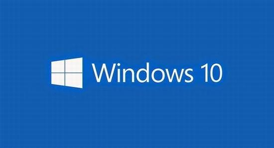

## 吐槽

最近因为客户需要，需要在 win7 上呈现一个触碰环境，来进行交互操作，类似于 android，并且需要通过点击 app 图标来展示相关网站。

经过评估，决定采用 WPF 来进行开发。众所周知 win7 在触控的支持上并不是特别好,所以就有了这篇**踩坑**总结。

**PS:其实直接升级系统，采用 win10 可以规避掉很多的问题，而且 win7 的授权费用与 win10 相当。**

## WPF 自带 webview 兼容性

WPF 自带的 webview 与系统 IE 版本是严格绑定的，但是有一点需要注意的是 WPF 中的 webview 默认会采用 IE7 文档模式进行渲染，而且 JS 的相关函数支持也是到 IE7，所以在浏览一些网站会出现 JS 运行错误的对话框。

因为采用 IE7 的文档模式渲染，所以触控支持也可以忽略不计了。所以这里推荐使用其他的浏览器内核封装，推荐 [CefSharp](https://github.com/cefsharp/CefSharp)。

[CefSharp](https://github.com/cefsharp/CefSharp) 是对 Chrome 的封装，所以它具备完整的**现代**浏览器特性。

## CefSharp 的触控支持

CefSharp WPF 默认是不带触控支持的，具体的可以看这个 [issure](https://github.com/cefsharp/CefSharp/issues/2245)。根据作者的说法推荐使用 WinFormsHost 包含 WinForm 用户控件的方法来实现。

具体做法：

1. 在解决方案中新建立一个 WinForm 项目，并将其中生成的相关模板代码删除。
2. 通过 nuget 添加 CefSharp WinForm 的项目依赖。
3. 修改项目的生成类型，改为类库。
4. 新建一个用户控件，这里我们改名为 CefUserControl。
5. 在用户控件中添加相关初始化代码，例如如下代码：

``` csharp
    public partial class CefUserControl : Form
    {
        ChromiumWebBrowser Default;

        public CefUserControl(string url)
        {
            InitializeComponent();

            if (!Cef.IsInitialized)
                Cef.Initialize();
            Default = new ChromiumWebBrowser(url);
            Default.LifeSpanHandler = new LifeSpanHandler();
            this.Controls.Add(Default);
            Default.Dock = DockStyle.Fill;
        }

        public static void Shutdown()
        {
            if (Cef.IsInitialized)
                Cef.Shutdown();
        }
    }
```
6. **编译，这里注意一点引用的 CefSharp 版本必须与生成的处理器类型一致，比如引用的是 X86 版本，你生成的时候也必须选择生成 X86 而不能使用默认的 AnyCpu的生成配置。**

7. 引用 WinForm项目在 WPF 的 XAML 中添加 

``` xml
        <WindowsFormsHost Name="browser">
        </WindowsFormsHost>
```

8. 在代码中添加初始化

``` csharp
    public WebPage(string url)
    {
        InitializeComponent();
        _control = new CefUserControl(url);
        _control.TopLevel = false;
        _control.FormBorderStyle = System.Windows.Forms.FormBorderStyle.None;
        browser.Child = _control;
    }
```

这样就完成了整个的初始化工作。

## CefSharp 触摸键盘

在 win10 操作系统中，当 CefSharp 中的 input 获得焦点的时候，触控键盘可以正常弹出。但是由于 win7 触控支持问题，并没有系统的解决方案。所以这里我采用了一个折中的方案，那就是通过监听浏览器事件来手动打开 win7 软键盘。但是这里有个问题，CefSharp 会接受所有的触控点击事件，并且不会冒泡向父级元素传递，所以我们无法通过监听窗口触控的相关事件来启动键盘。

既然原生事件通知拿不到，那只有另辟蹊径，通过 JS 来监听事件，然后通过回调调用 C# 方法来启用软键盘。具体的做法就是：

1. 在 CefSharp 中注册一个 JS 对象方法，该方法用来打开 win7 的软键盘。
2. 当 CefSharp 完成页面加载的的时候，执行 JS 来注册网页中的 foucs 事件。

这样就可以实现点击网页上的输入框自动弹出软键盘了。

主要代码如下：

```csharp

    public CefUserControl(string url)
    {
        InitializeComponent();

        if (!Cef.IsInitialized)
            Cef.Initialize();
        CefSharpSettings.LegacyJavascriptBindingEnabled = true;
        Default = new ChromiumWebBrowser(url);
        Default.LifeSpanHandler = new LifeSpanHandler();
        this.Controls.Add(Default);
        Default.Dock = DockStyle.Fill;
        Default.RegisterJsObject("jsObj", new JsObj(), BindingOptions.DefaultBinder);
        Default.LoadingStateChanged += (sender, e) =>
        {
            if (e.IsLoading == false)
            {
                Default.GetMainFrame().ExecuteJavaScriptAsync("document.addEventListener('focusin',function(e){ jsObj.showKeyBoard(); }, false);");
            }
        };
    }

    public class JsObj
    {
        public void ShowKeyBoard()
        {
            Process.Start(Environment.GetFolderPath(Environment.SpecialFolder.System) + System.IO.Path.DirectorySeparatorChar + "osk.exe");
        }
    }
```

**注意** 调用 c# 定义的对象方法时候，方法名第一个字母必须小写，否则会提示找不到该函数。

## 思考

在我看来针对于这种触控的开发还是基于 win10 或者 android 开发比较好，因为他们提供了更好的底层支持，而 win7 作为一个 2009 年发布的操作系统在这些方面不免有些力不从心，强行在上面进行触控程序的开发不管从成本还是用户体验上都不是很好。

所以大家都升级 win10 吧(微软记得给广告费)

