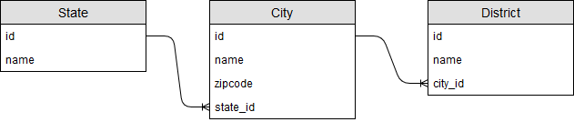

## 简述

odoo 作为一个优秀的开源ERP开发框架，在国外流行度很高，可能是主要专注于国外用户的使用习惯，所以会经常出现一种情况：国内很常见的一些功能在 odoo 中的缺失。

最近就遇到这么一个需求要求省市县的三级联动，翻了翻 odoo 自带的相关模块，奈何没有，网上也没有找到开源的相关模块。没办法只好自己写了一个，正好可以拿来练练手，下面我们就来讲一讲这个 odoo 模块的开发。

## models

在开始开发之前，我们首先要考虑下数据结构的问题，这个倒不难，根据以往经验我们很容易就可以得出如下数据结构图：



接下来我们把它转化为 odoo 的 model 代码：

``` python
from odoo import fields, models

# 由于 省份信息 odoo 系统中已经给出，所以不需要另外编写，直接使用即可。

class District(models.Model):
    """
    区县模型
    """
    _name = 'res.country.district'
    _description = 'District'
    _order = 'name'

    name = fields.Char("Name", required = True)
    city_id = fields.Many2one(
        'res.country.city', 'City'
    )

class City(models.Model):
    """
    城市模型
    """
    _name = 'res.country.city'
    _description = 'City'
    _order = 'name'

    name = fields.Char("Name", required=True, translate=True)
    zipcode = fields.Char("Zip")
    state_id = fields.Many2one(
        'res.country.state', 'State')

```

## 数据的准备

odoo 作为一个数据驱动的开发框架，我们首先需要做的就是原始数据的预处理，这里就是省市县数据的准备工作。

odoo 可以通过 [DataFiles]("https://www.odoo.com/documentation/11.0/reference/data.html") 在模块安装的时候进行相关数据的初始化，所以我们首先要想办法生成我们所需的 [DataFiles]("https://www.odoo.com/documentation/11.0/reference/data.html") 文件。

在翻阅系统自带模块的时候，我发现在 **中国会计科目表** 中已经将中国的省份信息添加进入了系统，基于 [DRY原则]("https://en.wikipedia.org/wiki/Don%27t_repeat_yourself")，我们可以直接利用其中的数据。

接下来的问题就是如何根据已有的省份信息 连同市县信息生成关联数据，并将其存储进入 odoo 系统。我们第一个想到的就是直接更新数据库，但是由于 odoo 本身会在自己系统内部维护一套模型数据，所以不推荐直接进行数据库原生操作，最好的选择是使用 [odoo DataFiles]("https://www.odoo.com/documentation/11.0/reference/data.html")。

根据相关文档，我们设计如下的xml结构：

1. 市

``` xml
      <record id="{city_id}" model="res.country.city">
      <!--city_id格式定为state_{省名拼音首字母}_city_{市拼音首字母}-->
         <field name="name">{city_name}</field>
         <field name="state_id" ref="l10n_cn.state_HE"/>
         <!--此处ref指向系统中已经存在的省份信息-->
      </record>
```

2. 县

``` xml
      <record id="{district_id}" model="res.country.district">
      <!--district_id格式定为city_{所属城市拼音首字母}_{区县拼音首字母}-->
         <field name="name">东城区</field>
         <field name="city_id" ref="china_address.state_bjs_city_sxq"/>
         <!--此处ref指向城市信息中的id-->
      </record>
```

数据结构定义好了，接下来的问题就是如何生成数据了，这里我写了一个脚本来生成我们需要的数据文件：



这里使用到的原始数据可以直接访问 [gist](https://gist.github.com/designershao/9f5b55edc73fcfac6814cc0a6377c77e)。

## 业务逻辑

三级联动的业务逻辑其实很简单，无外乎就是监听第一级然后更新第二级列表，以此类推。

与一般我们直接在前端页面编写逻辑不同，在 odoo 中我们就必须得利用 [onchange](https://www.odoo.com/documentation/11.0/reference/orm.html#onchange-updating-ui-on-the-fly) 来实现。

这里我们可以利用 [domain]() 来过滤联动的数据，比如当我选择江苏省的时候，城市下拉列表应该只过滤出所属于江苏省的城市数据。

部分逻辑代码如下：

``` python
    @api.onchange('state_id')
    def _onchange_state_id(self):
        self.city_id = None
        self.district_id = None
        if self.state_id:
            return {'domain': {'city_id': [('state_id', '=', self.state_id.id)]}}
        else:
            return {'domain': {'city_id': []}}
```

## 视图

为了方便演示，我们直接继承 partner 视图：

``` xml
        <record id="view_res_country_china_address_form" model="ir.ui.view">
            <field name="model">res.partner</field>
            <field name="inherit_id" ref="base.view_partner_form"/>
            <field name="arch" type="xml">
                <xpath expr="//div[hasclass('o_address_format')]" position = "inside">
                    <field options='{"no_open": True}' name="state_id" placeholder="State Select" class="o_address_city"/>
                    <field options='{"no_open": True}' name="city_id" placeholder="City Select" class="o_address_city"/>
                    <field options='{"no_open": True}' name="district_id" placeholder="District Select" class="o_address_city"/>
                </xpath>
            </field>
        </record>
```

## 总结

这个模块的核心代码量其实非常小，主要的工作量还是在省市县数据的准备上面。

由于 odoo 在国内的使用还不是特别多，所以这方面的中文开发资料还是偏少，出了问题一般不能很容易的直接找到答案。这里作为一个初学者我分享下自己的 odoo 学习方法：多看项目的 github 和 官方文档，融入到社区中去，理解 odoo 数据驱动的思路，还有就是熟练使用搜索引擎了。

对了，此模块的源代码已经托管至[github](https://github.com/designershao/odoo_china_address_module)，欢迎大家 fork 。