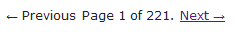
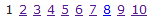
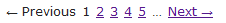
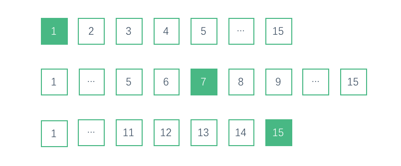
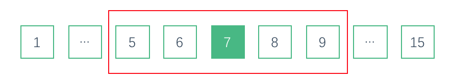
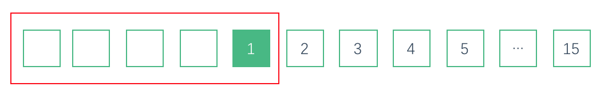

## 场景
在web开发中，面临展示大量数据的展示，分页是我们必不可少的选择，分页分为服务器端分页和客户端分页，不过今天我们不具体讲服务器端的分页逻辑，而是说说分页页码的显示逻辑。

在实际的开发过程中，我们常见的分页展示形式主要分为如下几种：

1. 单独显示上一页和下一页，并且提供控制按钮的。


2. 只显示页码的。


3. 折叠页码的。



其他常见的在工程上使用的分页显示基本上都是围绕在这三种类型上的延伸扩展。

## 思考

分页类型1 和 2 在实现上还是比较简单的，这里不做过多阐述，我们主要来思考下类型3（页码折叠）的实现。
仔细观察我们可以发现，类型3的显示总共分为以下3种情况:

**以下我们以总共15页进行图片展示分析**



这里我们先看第二种情况，也就是两边折叠，中间显示部分内容。

仔细观察,我们可以将其看作是5个格子的一个窗口，实际上显示就是这个窗口在所有页数中的移动。



既然我们已经把其看作是一个5格窗口的平移，那么是否可以将这个逻辑应用到第1 和 第2 种情况中去呢？答案是可以！我们首先来看一个特例那就是当前页是第一页的时候。



实际上我们可以看作之在页码1之前还有4个在范围之外的格子，并不显示。随着当前页码的移动，当窗口的5个格子全部显现，并且第一个格子与页码1不临界时，1之后显示省略号...


同理我们可以分析出,当窗口中的最后一个格子小于最后一个页码并且不与最后个页码临界，则最后一个页码前面一个格子显示省略号...


不过这里有个特殊情况就是当总页数等于7的时候，窗口的左右都与最小和最大页码数临界，所以此情况不用做特殊处理，直接显示所有的页码数即可。


## 实现

原理明白了，代码写起来就比较容易了，我这里使用python，并且简化了部分显示代码，但是整体逻辑还是可以验证的

``` python
def generate_pager_array(page_num, page_count):
    """
    根据相关规则生成分页信息
    :param page_num: 当前所在的页数
    :param page_count: 总页数
    :return:
    """
    window_size = 5
    if page_count <= 7: # 当总页数小于7的时候
        return list(map(lambda x: str(x), range(1, page_num - 1))) + ['{}'.format(page_num)] + list(map(lambda x: str(x), range(page_num + 1, page_count + 1)))
    else:
        out = []
        if page_num - window_size <= 2:
            for i in map(lambda x: str(x), list(range(1, window_size + 1))):
                if i == str(page_num):
                    out.append('{}'.format(i))
                else:
                    out.append(i)
            out.append('...')
            out.append(page_count)
        elif page_num - window_size > 2 and page_count - window_size <= page_num:
            out.append('1')
            out.append('...')
            for i in map(lambda x: str(x), list(range(page_count - window_size + 1, page_count))):
                if i == str(page_num):
                    out.append('{}'.format(i))
                else:
                    out.append(i)
            out.append(page_count)
        else:
            out.append('1')
            out.append('...')
            for i in map(lambda x: str(x), list(range(page_num - 2, page_num + 2 + 1))):
                if i == str(page_num):
                    out.append('{}'.format(i))
                else:
                    out.append(i)
            out.append('...')
            out.append(page_count)
        return out

```


## 总结

显示分页逻辑看起来简单，但真正写起来对一些新手来说还是有些难度的。但是只要仔细研究下相关的需求，还是可以比较容易的抽象出具体的解决方案的。
